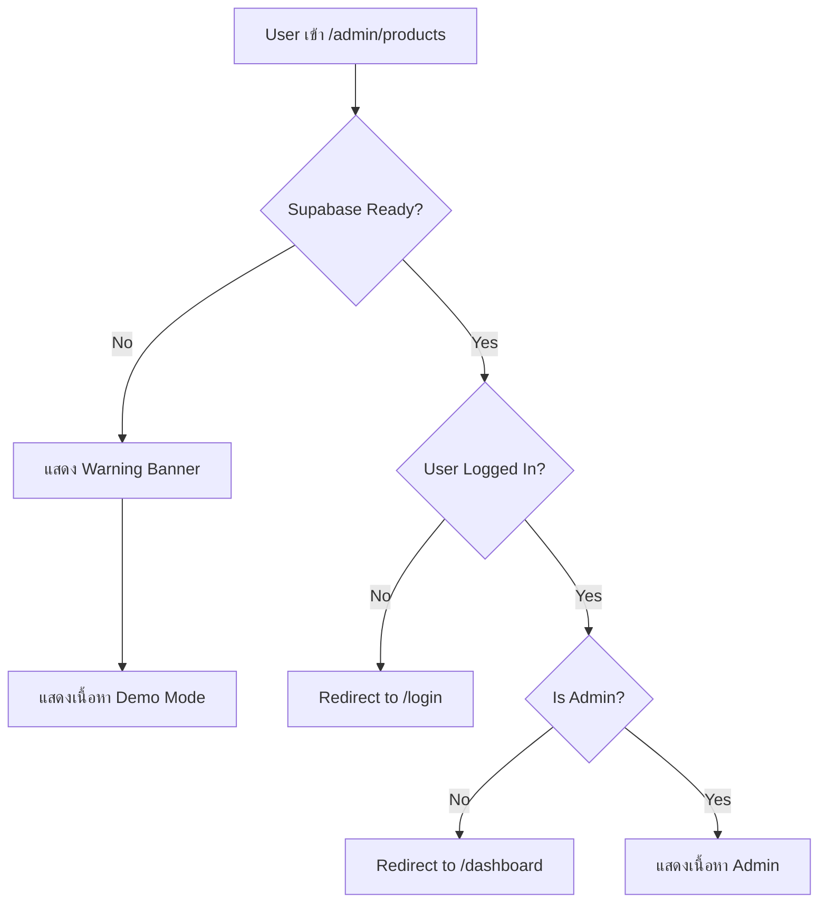

# 🔐 Route Guards Tutorial

คู่มือการใช้งาน Route Guards สำหรับการจัดการสิทธิ์การเข้าถึงหน้าต่างๆ ใน Omni Sales

## 📋 สารบัญ

1. [ภาพรวม](#ภาพรวม)
2. [การติดตั้ง](#การติดตั้ง)
3. [วิธีการใช้งาน](#วิธีการใช้งาน)
4. [การกำหนดค่า](#การกำหนดค่า)
5. [Troubleshooting](#troubleshooting)
6. [Best Practices](#best-practices)

---

## 🎯 ภาพรวม

Route Guards เป็นระบบป้องกันการเข้าถึงหน้าต่างๆ โดยไม่มีสิทธิ์ ประกอบด้วย:

### 1. **AdminGuard**
ป้องกันหน้า Admin ให้เฉพาะผู้ที่มี role `Owner` หรือ `Manager` เท่านั้น

**ใช้สำหรับ:**
- หน้า Admin Dashboard
- การจัดการสินค้า (Products Management)
- การจัดการผู้ใช้ (User Management)
- การตั้งค่าระบบ (System Settings)

### 2. **AuthGuard**
ตรวจสอบว่าผู้ใช้ login แล้วหรือไม่ (ไม่จำกัด role)

**ใช้สำหรับ:**
- Dashboard ทั่วไป
- หน้าดูข้อมูลลูกค้า
- หน้า CRM
- หน้าจัดการคำสั่งซื้อ

---

## 🚀 การติดตั้ง

Route Guards ได้ติดตั้งและพร้อมใช้งานแล้ว! แต่ต้องการ:

### 1. ตรวจสอบ AuthProvider

ใน `app/layout.tsx` ต้องมี `<AuthProvider>` wrapper:

```tsx
import { AuthProvider } from '@/lib/auth/AuthContext';

export default function RootLayout({ children }) {
  return (
    <html>
      <body>
        <AuthProvider>
          {children}
        </AuthProvider>
      </body>
    </html>
  );
}
```

### 2. ตรวจสอบ Supabase Configuration

ใน `.env.local`:

```bash
# Supabase URL & Keys
NEXT_PUBLIC_SUPABASE_URL=https://your-project.supabase.co
NEXT_PUBLIC_SUPABASE_ANON_KEY=your_anon_key_here
SUPABASE_SERVICE_ROLE_KEY=your_service_role_key_here
```

---

## 💻 วิธีการใช้งาน

### 1. การใช้ AdminGuard (สำหรับหน้า Admin)

```tsx
// app/admin/products/page.tsx
'use client';

import { AdminGuard } from '@/components/RouteGuard';
import AdminLayout from '@/components/admin/AdminLayout';

export default function AdminProductsPage() {
  return (
    <AdminGuard>
      <AdminLayout>
        <div className="p-6">
          <h1>Product Management</h1>
          {/* เนื้อหาหน้า Admin */}
        </div>
      </AdminLayout>
    </AdminGuard>
  );
}
```

**ผลลัพธ์:**
- ✅ ถ้าเป็น Owner/Manager → เข้าได้
- ❌ ถ้าเป็น role อื่น → redirect ไป `/dashboard`
- ❌ ถ้าไม่ได้ login → redirect ไป `/login`

---

### 2. การใช้ AuthGuard (สำหรับหน้าทั่วไป)

```tsx
// app/dashboard/page.tsx
'use client';

import { AuthGuard } from '@/components/RouteGuard';
import DashboardLayout from '@/components/DashboardLayout';

export default function DashboardPage() {
  return (
    <AuthGuard>
      <DashboardLayout>
        <div className="p-6">
          <h1>Dashboard</h1>
          {/* เนื้อหาหน้า Dashboard */}
        </div>
      </DashboardLayout>
    </AuthGuard>
  );
}
```

**ผลลัพธ์:**
- ✅ ถ้า login แล้ว (role ไหนก็ได้) → เข้าได้
- ❌ ถ้าไม่ได้ login → redirect ไป `/login`

---

### 3. การใช้ RouteGuard แบบ Custom

```tsx
import RouteGuard from '@/components/RouteGuard';

export default function CustomPage() {
  return (
    <RouteGuard
      requireAdmin={true}
      fallbackPath="/custom-fallback"
    >
      <div>Custom protected content</div>
    </RouteGuard>
  );
}
```

**Props ที่ใช้ได้:**
- `requireAdmin?: boolean` - ต้องการ Admin หรือไม่ (default: `false`)
- `fallbackPath?: string` - หน้าที่จะ redirect ถ้าไม่มีสิทธิ์ (default: `/dashboard`)

---

## ⚙️ การกำหนดค่า

### 1. Development Bypass Mode

สำหรับ development ที่ยังไม่มี Supabase setup สามารถ bypass auth ได้:

```bash
# .env.local
NEXT_PUBLIC_BYPASS_AUTH=true
```

**⚠️ คำเตือน:** อย่าเปิดในโหมด Production!

---

### 2. Role Permissions

กำหนดใน `lib/auth/AuthContext.tsx`:

```tsx
// Owner และ Manager เป็น Admin
setIsAdmin(role === 'owner' || role === 'manager');
```

**Roles ที่รองรับ:**
- `owner` - เจ้าของระบบ (Admin)
- `manager` - ผู้จัดการ (Admin)
- `staff` - พนักงาน
- `viewer` - ผู้ดู
- `null` - ไม่มี role (ยังไม่ได้กำหนด)

---

### 3. Custom Fallback Paths

กำหนดหน้า redirect ตาม use case:

```tsx
// ตัวอย่าง: สำหรับหน้า Billing
<AdminGuard fallbackPath="/pricing">
  {/* เนื้อหา */}
</AdminGuard>
```

---

## 🐛 Troubleshooting

### ปัญหา 1: Redirect Loop (วนไปวนมาไม่หยุด)

**สาเหตุ:**
- หน้า `/login` มี Guard wrapper
- Middleware redirect กลับมาเรื่อยๆ

**วิธีแก้:**
```tsx
// app/login/page.tsx - ห้ามใส่ Guard!
export default function LoginPage() {
  return <div>Login Form</div>; // ไม่ใส่ AuthGuard
}
```

---

### ปัญหา 2: Loading นานเกินไป

**สาเหตุ:**
- Supabase ยังไม่ตอบกลับ
- Network ช้า

**วิธีแก้:**
1. เช็ค Supabase credentials ใน `.env.local`
2. เปิด DevTools > Network tab ดู request
3. ใช้ `NEXT_PUBLIC_BYPASS_AUTH=true` ชั่วคราว (dev only)

---

### ปัญหา 3: แสดง "Supabase not configured"

**สาเหตุ:**
- ไม่มี Supabase URL หรือ keys

**วิธีแก้:**
```bash
# .env.local
NEXT_PUBLIC_SUPABASE_URL=https://your-project.supabase.co
NEXT_PUBLIC_SUPABASE_ANON_KEY=your_key_here
```

**หรือ bypass ชั่วคราว:**
```bash
NEXT_PUBLIC_BYPASS_AUTH=true
```

---

### ปัญหา 4: User มี role แต่ไม่สามารถเข้า Admin ได้

**สาเหตุ:**
- Role ไม่ตรงกับ `owner` หรือ `manager`

**วิธีแก้:**
1. ตรวจสอบ role ใน database:
```sql
SELECT id, email, role FROM users WHERE email = 'your@email.com';
```

2. อัพเดท role:
```sql
UPDATE users SET role = 'owner' WHERE email = 'your@email.com';
```

---

## ✅ Best Practices

### 1. ใช้ Guard ทุกหน้าที่ต้องการ Authentication

```tsx
// ✅ ถูกต้อง
<AuthGuard>
  <DashboardLayout>...</DashboardLayout>
</AuthGuard>

// ❌ ผิด - ไม่มี Guard
<DashboardLayout>...</DashboardLayout>
```

---

### 2. อย่าใส่ Guard ซ้อนกัน

```tsx
// ❌ ผิด - ซ้อน Guard
<AuthGuard>
  <AdminGuard>
    <div>Content</div>
  </AdminGuard>
</AuthGuard>

// ✅ ถูกต้อง - ใช้ Guard เดียว
<AdminGuard>
  <div>Content</div>
</AdminGuard>
```

---

### 3. ใช้ AdminGuard สำหรับหน้า Sensitive

```tsx
// หน้าที่ควรใช้ AdminGuard:
- /admin/*
- /admin/settings/*
- /admin/users/*
- /admin/tenants/*

// หน้าที่ใช้ AuthGuard:
- /dashboard
- /customers
- /orders
- /inventory
```

---

### 4. เช็ค Role ใน Component Logic (ถ้าจำเป็น)

```tsx
'use client';

import { useAuth } from '@/lib/auth/AuthContext';

export default function MyComponent() {
  const { isAdmin, userRole } = useAuth();

  return (
    <div>
      {isAdmin && (
        <button>Delete (Admin Only)</button>
      )}

      <p>Your role: {userRole}</p>
    </div>
  );
}
```

---

### 5. Handle Loading State อย่างถูกต้อง

```tsx
import { useAuth } from '@/lib/auth/AuthContext';

export default function MyPage() {
  const { user, loading } = useAuth();

  if (loading) {
    return <div>Loading...</div>;
  }

  return <div>Content for {user?.email}</div>;
}
```

---

## 📊 State Diagram

```
User เข้าหน้า
    ↓
[Loading = true]
    ↓
Auth Check (Supabase)
    ↓
    ├─→ Supabase ไม่พร้อม → แสดง Warning Banner → แสดงเนื้อหา
    ├─→ ไม่มี User → Redirect to /login
    ├─→ มี User แต่ไม่ใช่ Admin (AdminGuard) → Redirect to /dashboard
    └─→ ผ่านทุกเช็ค → แสดงเนื้อหา
```

---

## 🔄 Workflow Example

### สำหรับ Admin Page:



---

## 🚀 Quick Start Checklist

เมื่อสร้างหน้าใหม่ ให้เช็คตามนี้:

- [ ] เลือก Guard ที่เหมาะสม (AdminGuard หรือ AuthGuard)
- [ ] Wrap component ด้วย Guard
- [ ] ทดสอบกรณี: ไม่ได้ login
- [ ] ทดสอบกรณี: login แต่ไม่ใช่ admin (สำหรับ AdminGuard)
- [ ] ทดสอบกรณี: login และเป็น admin
- [ ] ตรวจสอบ loading state
- [ ] ตรวจสอบ redirect path ว่าถูกต้อง

---

## 📝 Code Templates

### Template 1: Admin Page

```tsx
'use client';

import { AdminGuard } from '@/components/RouteGuard';
import AdminLayout from '@/components/admin/AdminLayout';

export default function MyAdminPage() {
  return (
    <AdminGuard>
      <AdminLayout>
        <div className="p-6 space-y-6">
          <h1 className="text-3xl font-bold">My Admin Page</h1>
          {/* Your content here */}
        </div>
      </AdminLayout>
    </AdminGuard>
  );
}
```

### Template 2: Regular Protected Page

```tsx
'use client';

import { AuthGuard } from '@/components/RouteGuard';
import DashboardLayout from '@/components/DashboardLayout';

export default function MyPage() {
  return (
    <AuthGuard>
      <DashboardLayout>
        <div className="p-6 space-y-6">
          <h1 className="text-3xl font-bold">My Page</h1>
          {/* Your content here */}
        </div>
      </DashboardLayout>
    </AuthGuard>
  );
}
```

### Template 3: Public Page (No Guard)

```tsx
// app/about/page.tsx
export default function AboutPage() {
  return (
    <div className="p-6">
      <h1>About Us</h1>
      <p>This page is public, no authentication required.</p>
    </div>
  );
}
```

---

## 🔧 Advanced Configuration

### Custom Role Check

ถ้าต้องการเช็ค role เพิ่มเติม สามารถแก้ไข `components/RouteGuard.tsx`:

```tsx
// ตัวอย่าง: เพิ่ม ManagerGuard
export function ManagerGuard({ children }: { children: React.ReactNode }) {
  const { userRole } = useAuth();

  if (userRole !== 'manager' && userRole !== 'owner') {
    return <div>Access Denied</div>;
  }

  return <>{children}</>;
}
```

---

## 📞 Support

หากพบปัญหา:
1. ดู Console Logs (F12 > Console)
2. เช็ค Network Tab (F12 > Network)
3. ตรวจสอบ `.env.local`
4. ลอง bypass auth ด้วย `NEXT_PUBLIC_BYPASS_AUTH=true`

---

## 📚 เอกสารเพิ่มเติม

- [Supabase Auth Docs](https://supabase.com/docs/guides/auth)
- [Next.js Routing](https://nextjs.org/docs/app/building-your-application/routing)
- [React Context API](https://react.dev/reference/react/useContext)

---

**เวอร์ชั่น:** 1.0.0
**อัพเดทล่าสุด:** 2025-01-28
**ผู้จัดทำ:** Claude Code
